# Merchant Agentic assistant – Technical Overview

> **Người báo cáo**: Nguyễn Văn Minh 
> **Email**: v.minhnv63@vinsmartfuture.tech
> **Repo**: [Github - Merchant AI](https://github.com/minhnvm2307/Merchant_Agentic_Assistant.git)

## Mục lục

- [1. Bài toán](#1-bài-toán)
- [2. Use case](#2-use-case)
- [3. Giải pháp](#3-giải-pháp)
- [4. Thông tin được sử dụng](#4-thông-tin-được-sử-dụng)
- [5. Kiến trúc và nhiệm vụ các tác tử](#5-kiến-trúc-và-nhiệm-vụ-các-tác-tử)
- [6. Kỹ thuật cốt lõi](#6-kỹ-thuật-cốt-lõi)
   - [6.1. Frameworks](#61-frameworks)
   - [6.2. Ngữ cảnh hội thoại và bộ nhớ dài hạn](#62-ngữ-cảnh-hội-thoại-và-bộ-nhớ-dài-hạn)
   - [6.3. Hỏi đáp tài liệu (RAG)](#63-hỏi-đáp-tài-liệu-rag)
   - [6.4. Observation](#64-observation)
   - [6.5. Evaluation](#65-evaluation)
- [7. Giá trị hệ thống](#7-gia-tri-he-thong)
- [8. Giao diện](#8-giao-diện)


## 1. Bài toán

Merchant Management AI giúp chủ quán hỏi dữ liệu vận hành, thị trường và chính sách bằng ngôn ngữ tự nhiên, thay vì phải tự tổng hợp từ nhiều màn hình và tài liệu.

| Người dùng | Vấn đề cần giải quyết |
|---|---|
| Chủ quán/đối tác XanhSM | Tìm kiếm các Merchant, thị trường quanh khu vực, hiểu nhu cầu khách hàng, tra chính sách nền tảng và nhận khuyến nghị phù hợp với quán của mình. |
| Đội ngũ phát triển | Theo dõi hành vi agent, đánh giá chất lượng tự động, kiểm soát tài nguyên LLM |

## 2. Use case

| Use case | Ví dụ câu hỏi | Giá trị nhận được |
|---|---|---|
| Khám phá thị trường | “Quán sushi nào cạnh tranh với tôi trong bán kính 3 km?” | Danh sách quán liên quan và điểm so sánh. |
| Phân tích chủ quán | “Đánh giá chất lượng vận hành của quán tôi.” | Nhận định từ hồ sơ, hành vi và đưa ra hành động. |
| Phân tích phản hồi khách hàng | “Các phản hồi tiêu cực gần đây tập trung vào vấn đề nào?” | Chủ đề cần ưu tiên cải thiện. |
| Tra cứu chính sách | “Điều kiện tham gia ưu đãi là gì?” | Câu trả lời có căn cứ từ kho tài liệu chính thức. |

## 3. Giải pháp

Hệ thống dùng kiến trúc nhiều tác tử (**Multi-Agent**): điều phối chọn chuyên gia (**subagent**) phù hợp, sau đó trả lời trực tiếp hoặc tổng hợp kết quả. Linh hoạt với nhiều loại câu hỏi.

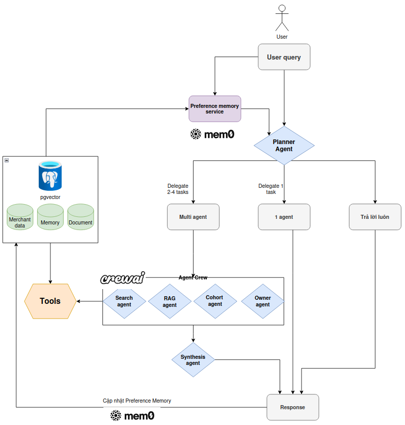

> *Mô tả*: Câu hỏi được phân loại theo 3 mức độ phức tạp (1-Câu hỏi đơn giản hoặc đã đủ ngữ cảnh; 2-Câu hỏi với 1 nhiệm vụ xác định rõ ràng; 3-Câu hỏi cần phân tích nhiều khía cạnh, thành phần)

Nguyên tắc xử lý:

- Câu hỏi đơn giản hoặc đã đủ ngữ cảnh được trả lời ngay.
- Câu hỏi nghiệp vụ được giao cho đúng chuyên gia; các việc độc lập chạy song song.
- Chỉ tổng hợp khi có từ hai kết quả chuyên gia trở lên.
- Mỗi câu trả lời dựa trên bằng chứng từ nguồn dữ liệu hoặc tài liệu đã truy xuất.
- Quản lý conversation memory hiệu quả phù hợp cho hệ thống cá nhân hóa


## 4. Thông tin được sử dụng

Hệ thống chỉ đưa vào mô hình các thông tin phục vụ trực tiếp cho câu hỏi, thay vì gửi toàn bộ bản ghi dữ liệu.

| Nhóm dữ liệu | Thông tin được dùng |
|---|---|
| Hồ sơ quán | Loại hình, khu vực, giá, món, nhóm khách hàng |
| Đánh giá | Điểm số, phản hồi và chủ đề tích cực/tiêu cực. |
| Menu | Các món ăn, giá, hình ảnh |
| Chỉ số vận hành | Thời gian chuẩn bị đồ, tỉ lệ hủy đơn |
| Tài liệu chính sách | Điều khoản chính thức của XanhSM |

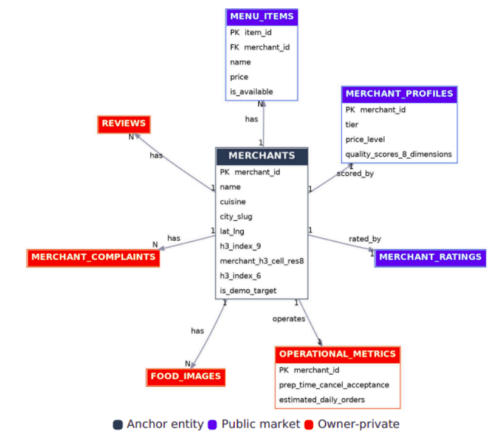
> Hình 2: Mô hình dữ liệu của merchant

## 5. Kiến trúc và nhiệm vụ các tác tử

| Thành phần | Nhiệm vụ | Khi được dùng |
|---|---|---|
| Điều phối (planner) | Xác định dữ liệu cần thiết; trả lời ngay hoặc giao việc. | Mọi yêu cầu. |
| Chuyên gia tìm kiếm (Search) | Tìm kiếm và so sánh quán ăn. | Đối thủ, khu vực, món, giá, xu hướng. |
| Chuyên gia phân tích (owner) | Phân tích hồ sơ và hoạt động của quán. | Câu hỏi về quán của user |
| Chuyên gia đánh giá | Phân tích phản hồi và chất lượng trải nghiệm. | Hài lòng, khiếu nại, điểm cải thiện. |
| Chuyên gia thị trường | Phân tích xu hướng thị trường, đánh giá nhóm merchant, so sánh quán của user. | Phân tích, so sánh sâu. |
| Chuyên gia chính sách | Truy xuất tài liệu và giải thích quy định. | Câu hỏi cần nguồn tài liệu chính thức. |
| LLM tổng hợp | Kết hợp các kết quả độc lập. | Khi có nhiều agent trả về kết quả. |

> Phân vai rõ ràng giúp câu hỏi đơn nguồn được xử lý nhanh, câu hỏi phức tạp vẫn kết hợp được nhiều góc nhìn mà không tạo vòng lặp giao việc.

## 6. Kỹ thuật cốt lõi

### 6.1. Frameworks

| Kỹ thuật | Giải quyết | Hiệu quả |
|---|---|---|
| Framework multi agent: **CrewAI** | Khai báo, tạo luồng multi-agent hiệu quả | Phát triển nhanh, mã ngắn gọn, dễ kiểm thử. |
| Cấp quyền **Tool** cho agent theo từng nhiệm vụ | Chuyên gia gọi sai nguồn dữ liệu, truy cập các dữ liệu nhạy cảm. | Chỉ dùng dữ liệu cần thiết, dễ kiểm soát và kiểm toán. |
| **Mem0:** Quản lý agent memory | Cá nhân hóa hành vi người dùng, quản lý conversation memory hiệu quả | Ghi nhớ ngữ cảnh quan trọng lâu dài, tăng trải nghiệm người dùng. |
| **LangFuse**: Hệ thống giám sát, đánh giá tự động | Debug, giám sát hành động của hệ thống, quản lý PROMPT  | Hệ thống tích hợp sẵn dễ dàng, đánh giá LLM-as-Judge tự động, quản lý prompt version hiệu quả |
| Kiểm soát **input/output** của Agent | Che các trường dữ liệu nhạy cảm, định dạng trả về có cấu trúc rõ ràng | Giảm token/độ trễ; chỉ hiển thị thông tin thân thiện có căn cứ. |


### 6.2. Ngữ cảnh hội thoại và bộ nhớ dài hạn

Hệ thống dùng hai lớp ngữ cảnh:

| Lớp ngữ cảnh | Mục tiêu | Ví dụ |
|---|---|---|
| Lịch sử gần đây | Hiểu tham chiếu trong cuộc hội thoại hiện tại mà không nạp cả transcript. | “Quán đó” được hiểu là quán vừa nói ở lượt trước. |
| Bộ nhớ ngữ nghĩa Mem0 | Lưu và tìm lại thông tin bền vững, sở thích hoặc bối cảnh lặp lại của người dùng. | Đối tác muốn đổi phong cách xưng hô, trả lời, hoặc muốn hệ thống ghi nhớ các vấn đề quán gặp phải, đối thủ cạnh tranh. |

Bộ nhớ được tìm theo ý nghĩa của câu hỏi; chỉ một số ký ức liên quan được đưa vào ngữ cảnh. Việc ghi nhớ diễn ra nền, không làm chậm phản hồi.

#### Semantic memory với Mem0

Hệ thống sử dụng phương pháp quản lý Long-term memory với **Mem0** - hệ thống self-hosted riêng biệt để quản lý memory.

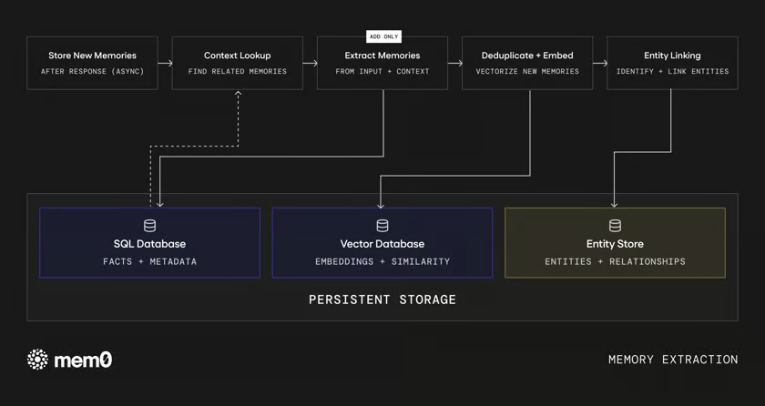

Phương pháp đã được đánh giá có hiệu quả nhớ dài hạn tốt và mức tiêu thụ token thấp

|Benchmark	|Score	|Average tokens / query|
|--|--|--|
|LoCoMo	|92.5	|6,956|
|LongMemEval	|94.4	|6,787|
|BEAM (1M)	|64.1	|6,719|
|BEAM (10M)|	48.6	|6,914|

Mem0 cung cấp lớp memory riêng cho từng cá nhân, thực thể và quản lý với Graph Memory, các thông tin memory gắn kết với các Entity đã được trích xuất qua các conversation.

```python
user_id  = quản lý memory theo từng user
agent_id = Theo từng agent
run_id   = Memory với từng phiên hỏi đáp
```

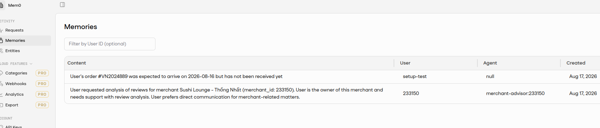
> Giao diện quản lý memory (Mem0) - Self hosted

#### Phướng pháp tích hợp:

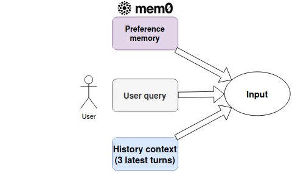

Mỗi request chỉ gửi query hiện tại tới semantic search. Mem0 trả về tối đa
**3-5 memories** liên quan để Agent sử dụng, thay vì đưa toàn bộ chat log vào prompt. 3 đoạn chat gần nhất được đưa vào để đảm bảo ngữ cảnh tối thiểu. 

**Lưu trữ**: Sử dụng database chung với merchant data (Postgresql + pgvector)

### 6.3. Hỏi đáp tài liệu (RAG)

Kho chính sách được xây dựng từ các nguồn chính thức đã xác định trong `xanhsm_policy_sources.yaml`. Nội dung bao gồm quy định đối tác, chương trình/ưu đãi, vận hành, thanh toán và câu hỏi thường gặp.

| Kỹ thuật | Cách áp dụng | Case giải quyết |
|---|---|---|
| Chunking theo cấu trúc tài liệu | Giữ tiêu đề, nguồn và thứ tự; mỗi đoạn 1.024 token, chồng lấn 64 token. | Không mất điều kiện/ngoại lệ ở ranh giới đoạn. |
| Embedding ngữ nghĩa | Dùng mô hình BAAI/bge-small-en-v1.5, vector 384 chiều cho kho chính sách. | Tìm được đoạn có nghĩa tương tự dù cách hỏi khác từ tài liệu. |
| Hybrid retrieval | BM25 + pgvector; mỗi nhánh lấy 20 kết quả, hợp nhất bằng Reciprocal Rank Fusion. | Giữ được từ khóa chính xác và hiểu cách hỏi tự nhiên. |
| Lọc và trích dẫn nguồn | Chọn các đoạn phù hợp nhất để tạo câu trả lời có căn cứ. | Tránh trả lời theo kiến thức chung khi chính sách nội bộ có quy định cụ thể. |

#### Hybrid retrieval với BM25 + Dense vector cosine score và RRF

Policy search kết hợp hai tín hiệu độc lập:
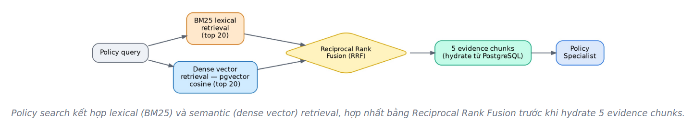

1. **BM25 lexical retrieval** lấy tối đa 20 chunks phù hợp theo từ khóa và
   thuật ngữ chính sách.
2. **Dense vector retrieval** lấy tối đa 20 chunks gần nhất theo cosine
   similarity trên pgvector.
3. **Reciprocal Rank Fusion** hợp nhất hai ranking mà không phụ thuộc trực
   tiếp vào thang điểm riêng của BM25 hoặc vector search.
4. Hệ thống chọn 5 evidence chunks có thứ hạng tốt nhất và hydrate nội dung
   đầy đủ từ PostgreSQL.

### 6.4. Observation

Langfuse ghi nhận đầu vào/đầu ra dưới dạng văn bản nghiệp vụ rõ ràng. Truy xuất bộ nhớ, điều phối, gọi công cụ và bằng chứng được theo dõi riêng.

Các chỉ số chính:

- Thời gian đến token đầu tiên, thời gian toàn bộ và số lần gọi mô hình/công cụ.
- Nguồn dữ liệu, bằng chứng, số token, lỗi và phiên bản prompt.

Nhờ đó đội vận hành truy vết được câu trả lời sai hoặc chậm đến đúng bước gây ra vấn đề.

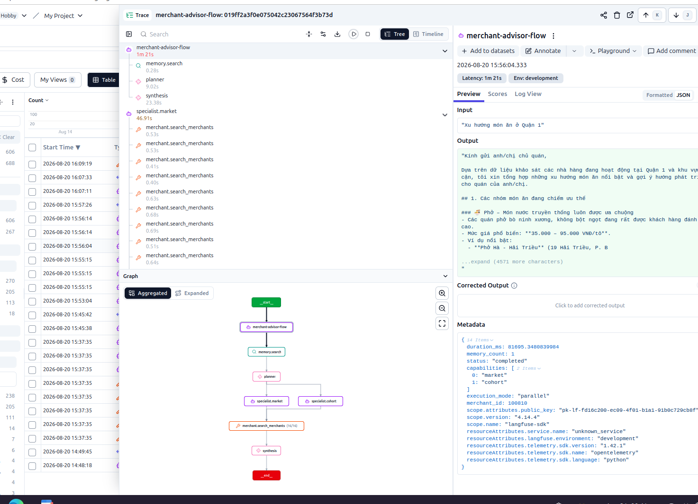

### 6.5. Evaluation

Bộ đánh giá sử dụng các tình huống đại diện cho luồng thực tế:

| Nhóm đánh giá | Kiểm tra |
|---|---|
| Điều phối | Có trả lời trực tiếp khi đủ thông tin; có chọn đúng chuyên gia khi cần dữ liệu. |
| RAG | Đoạn chính sách đúng, liên quan và đủ điều kiện/ngoại lệ quan trọng. |
| Ngữ cảnh | Hiểu tham chiếu đa lượt và dùng đúng ký ức liên quan. |
| LLM evaluators | Tự động đánh giá hệ thống sau khi triển khai với Langfuse Evaluators |

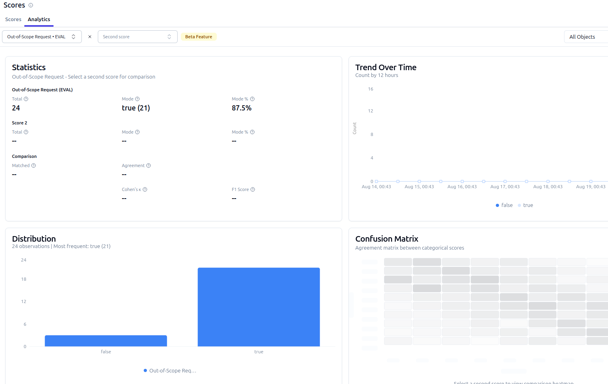
> Evaluation: Biểu đồ thống kê số metrics Out-of-Scope (Langfuse)

#### Kết quả đánh giá

1. **Latency**: 
   - Nhóm trả lời nhanh: ~8-10s
   - Nhóm 1 agent: ~30s
   - Nhóm multi-agent: ~1-2p

2. **LLM-as-Judge**:
   - Điều phối multi-agent: 88.9% passed (25 testcases)
   - Jailbreaks Pass Rate: 75%
   - Memory Preference: 83% (đo hiệu quả lưu trữ, truy vấn memory)

3. **Policy doc retrieval**: 20 testcases (100% passed)

## 7. Giá trị hệ thống

- Trả lời nhanh hơn vì chỉ gọi chuyên gia và dữ liệu thực sự cần thiết.
- Cá nhân hóa theo hồ sơ quán, lịch sử trao đổi và sở thích bền vững.
- Độ tin cậy cao hơn nhờ RAG hybrid, dữ liệu có cấu trúc và bằng chứng truy xuất được.
- Dễ vận hành và cải tiến nhờ quan sát từng bước và bộ đánh giá lặp lại.

## 8. Giao diện

<div style="display: grid; grid-template-columns: repeat(2, minmax(0, 1fr)); gap: 12px;">
   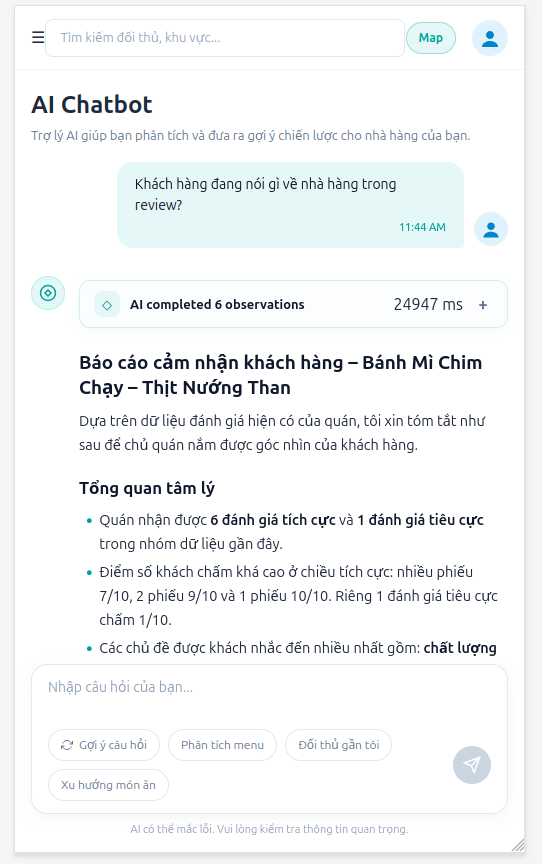
   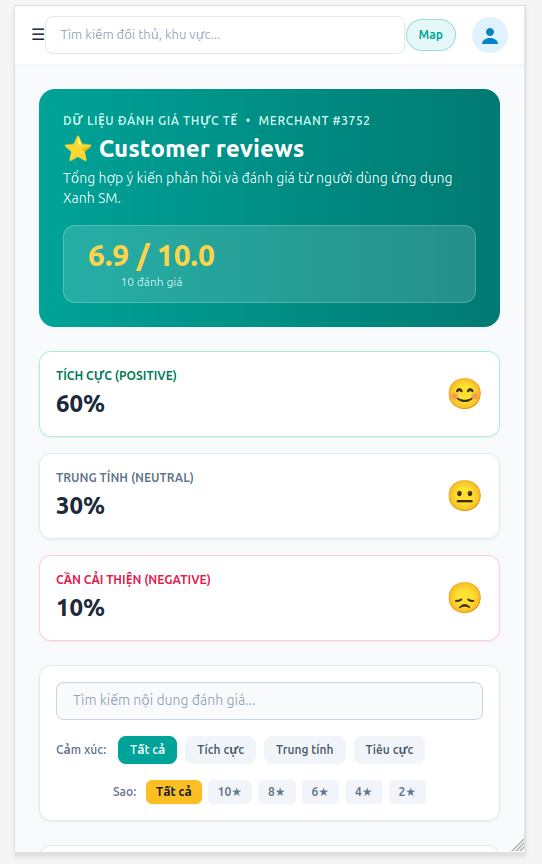
   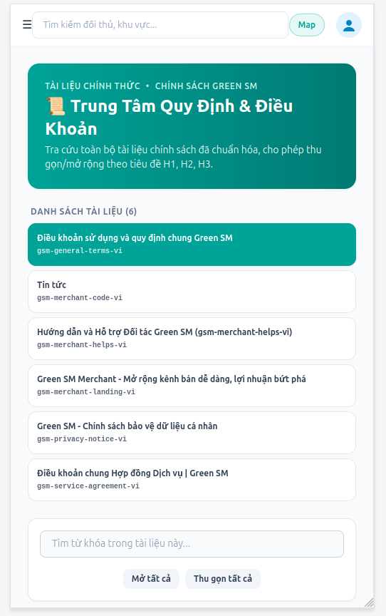
   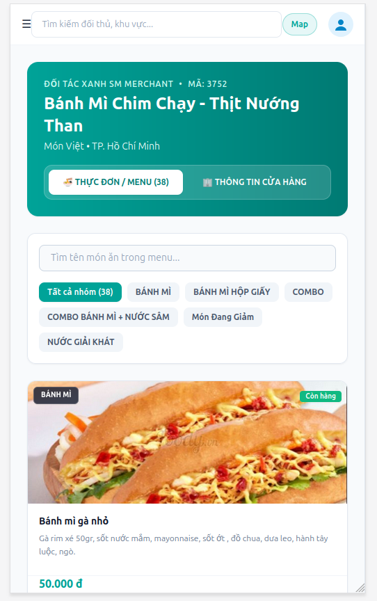
</div>