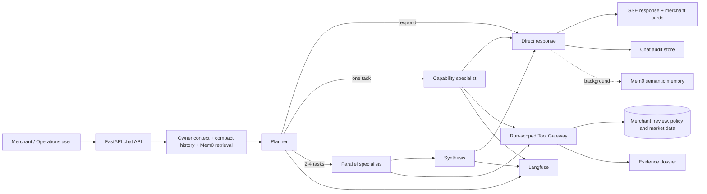

# Merchant Management AI — Technical Overview

> Phạm vi: Merchant Advisor, nền tảng dữ liệu nghiệp vụ, policy RAG, semantic memory và quan sát/evaluation.  
> Tài liệu tập trung vào các kỹ thuật kiến trúc đã có trong hệ thống; không mô tả chi tiết migration, prompt edge case hoặc xử lý chuỗi nhỏ lẻ.

## 1. Bài toán và đối tượng sử dụng

Merchant Advisor hỗ trợ chủ nhà hàng trên nền tảng Green SM đưa ra quyết định vận hành dựa trên dữ liệu thật thay vì phải tự tổng hợp nhiều màn hình, báo cáo và tài liệu chính sách. Một câu hỏi tưởng như đơn giản — *“Vì sao rating giảm và nên ưu tiên cải thiện gì?”* — thường đồng thời cần hồ sơ quán, chỉ số vận hành, review, complaint, menu/ảnh, benchmark thị trường và chính sách liên quan. Các nguồn này khác quyền truy cập, khác cấu trúc và không thể đưa nguyên trạng vào một prompt.

Nhóm người dùng chính gồm:

- **Chủ merchant / quản lý vận hành**: cần tìm đối thủ, hiểu chất lượng quán, xử lý phản hồi khách hàng, so sánh thị trường và nhận khuyến nghị có căn cứ.
- **Nhân sự vận hành hoặc merchant success**: cần tra cứu chính sách, hỗ trợ merchant nhanh hơn và giải thích được nguồn dữ liệu của một khuyến nghị.
- **Nhóm sản phẩm và chất lượng AI**: cần theo dõi latency, chi phí, tool execution, chất lượng routing và độ tin cậy của câu trả lời theo từng phiên bản prompt/model.

Pain point không chỉ là “thiếu chatbot”. Hệ thống cần giải quyết đồng thời bốn vấn đề: hợp nhất dữ liệu phân tán, điều phối đúng nguồn dữ liệu, bảo vệ dữ liệu riêng tư giữa các merchant, và tạo câu trả lời có thể truy vết bằng chứng. Pipeline Sprint 1 thiên về nhiều lớp LLM tuần tự, nên ngay cả câu hỏi đơn giản cũng phải đi qua các bước phân tích/rewrite/điều phối dư thừa. Điều này làm tăng latency, token usage và số điểm có thể lỗi.

## 2. Giải pháp tổng thể

Giải pháp là một **Merchant Advisor agentic runtime** lấy LLM làm lớp suy luận và diễn đạt, còn application runtime chịu trách nhiệm cho các ràng buộc cần tính quyết định: quyền dữ liệu, phạm vi tool, cấu trúc output, bằng chứng và observability.

Runtime dùng mô hình **Planner – Specialist – Conditional Synthesis**:

1. Planner nhận query hiện tại, ngữ cảnh owner, một lượng nhỏ chat history và semantic memories liên quan.
2. Planner quyết định trả lời trực tiếp hoặc giao từ một đến bốn nhiệm vụ độc lập cho specialist.
3. Specialist chỉ dùng những tool thuộc capability đã được cấp. Một task không thể giao tiếp hoặc handoff sang agent khác.
4. Khi có nhiều specialist, synthesis tổng hợp các kết quả đã có thành một response thống nhất. Với một specialist, kết quả được trả thẳng để tránh thêm một LLM call.
5. Chat canonical được lưu cho UI/audit; completed turn được ghi vào semantic memory ngoài critical path.

Kiến trúc này làm cho “đơn giản” trở thành fast path thực sự: chitchat, follow-up đã đủ context hoặc câu hỏi không cần dữ liệu không phải kích hoạt tool chain. Ngược lại, câu hỏi phức tạp vẫn có thể phân rã và thực thi song song mà không hình thành hierarchy loop không kiểm soát.

## 3. Use case mục tiêu

| Use case | Giá trị cho người dùng | Nguồn năng lực chính |
| --- | --- | --- |
| Tìm merchant | Tìm quán theo món, vị trí, mức giá, rating hoặc tiêu chí cụ thể | Search specialist và dữ liệu merchant công khai |
| Nghiên cứu thị trường | Xác định cohort tương tự, benchmark rating, giá menu, review và image metadata | Market/Cohort specialist, public projection |
| Phân tích quán owner | Hiểu profile, operational metrics, review, complaint, menu/ảnh và điểm yếu | Owner specialist và Review specialist |
| Khuyến nghị cải thiện | Chuyển evidence thành các hành động ưu tiên, thay vì nhận xét chung chung | Owner capability, diagnosis/recommendation tools |
| Hỏi đáp chính sách | Tìm đúng điều khoản Green SM và đưa trích dẫn có nguồn | Policy specialist, hybrid RAG |
| So sánh hình ảnh món ăn | So owner image quality/blur với mặt bằng công khai của cohort | Image comparison tool và public cohort |
| Hỗ trợ hội thoại liên tục | Ghi nhớ preference, bối cảnh và follow-up giữa các phiên | Compact history + Mem0 semantic memory |

Các use case được tổ chức theo **capability**, không theo một prompt lớn duy nhất. Điều này giúp hệ thống thêm hoặc thay đổi nghiệp vụ mà không phải cấp toàn bộ quyền truy cập dữ liệu cho mọi agent.

## 4. Thông tin dữ liệu được dùng

Hệ thống sử dụng nhiều nhóm dữ liệu, nhưng chỉ đưa vào mỗi use case phần thông tin cần thiết.

| Nhóm thông tin | Nội dung được sử dụng | Mục đích |
| --- | --- | --- |
| Hồ sơ merchant | Tên, thành phố/khu vực, cuisine, category, price level, menu, rating và thuộc tính công khai | Search, nhận diện cohort, mô tả quán |
| Dữ liệu owner-private | Operational metrics, review/complaint chi tiết, quality dimensions, menu/image của quán owner | Diagnosis và recommendation cho chính chủ quán |
| Dữ liệu thị trường công khai | Rating/review public, menu price, location, public image metadata và các dimension được phép công bố | So sánh cạnh tranh và benchmark cohort |
| Dữ liệu feedback | Sentiment, rating distribution, theme, review samples và complaint signals | Phân tích trải nghiệm khách hàng/tài xế |
| Tri thức chính sách | Điều khoản sử dụng, quy chế Food, tranh chấp/khiếu nại, dữ liệu cá nhân, hợp đồng dịch vụ, quy tắc ứng xử và hướng dẫn merchant | Policy Q&A có trích dẫn |
| Dữ liệu hội thoại | User message, assistant response, session context, preference/fact đã trích xuất | Follow-up, cá nhân hóa và audit |
| Dữ liệu quan sát | Trace, input/output text, tool invocation, token usage, latency, evidence status và prompt version | Monitoring, debugging và evaluation |

Nguyên tắc quan trọng là **public và private không được trộn lẫn theo cách làm rò rỉ dữ liệu**. Dữ liệu vận hành riêng của owner chỉ phục vụ owner-bound task. Khi phân tích đối thủ, hệ thống chỉ dùng public projection và aggregate cohort; không suy ngược KPI, complaint hay diagnosis riêng của competitor.

## 5. Từ use case đến kiến trúc agent

Planner là điểm ra quyết định duy nhất. Nó không chạy tool và không tự thực thi phân tích dài; nhiệm vụ là chọn một trong hai contract:

- `respond`: context hiện có đủ để trả lời trực tiếp.
- `delegate`: tạo một đến bốn task khác capability, mỗi task có instruction ngắn và scope rõ ràng.

Các specialist tương ứng với ranh giới nghiệp vụ:

| Agent | Nhiệm vụ | Phạm vi dữ liệu/tool |
| --- | --- | --- |
| **Market/Search** | Tìm merchant và lấy chi tiết công khai cần thiết | Public merchant search và public detail |
| **Policy** | Tìm, đọc và diễn giải chính sách | Hybrid policy retrieval |
| **Cohort** | Tạo cohort, aggregate và benchmark owner với thị trường | Public search, cohort aggregation, comparison |
| **Owner** | Phân tích toàn diện quán đang sở hữu | Owner profile, metrics, menu/image, diagnosis, recommendation |
| **Review** | Tổng hợp review và complaint thành theme, sentiment, issue | Owner review và complaint retrieval |
| **Synthesis** | Hợp nhất nhiều specialist result thành response duy nhất | Không có tool; chỉ dùng evidence đã thu thập |

Lý do tách này là mỗi use case có **đồ thị phụ thuộc và quyền dữ liệu khác nhau**. Ví dụ recommendation cần diagnosis có evidence; benchmark cần candidate search rồi mới aggregate cohort; còn policy Q&A chỉ cần retrieval. Một prompt toàn năng dễ cấp dư tool, lặp tool call và khó audit. Capability-bound specialists giúp mỗi run biết rõ agent nào được gọi, dữ liệu nào đã được dùng và giới hạn nào áp dụng.

Synthesis chỉ xuất hiện khi cần hợp nhất nhiều nhánh. Đây là điểm tối ưu quan trọng: không thêm một lần generation chỉ để “định dạng lại” kết quả của một specialist.

## 6. Kỹ thuật agentic cốt lõi

### 6.1 Structured decision và tool execution có kiểm soát

LLM không được tin cậy như một parser tự do. Planner và synthesis dùng **Instructor-py trên OpenAI-compatible client** kết hợp Pydantic response model. Planner phải trả về union có discriminator `respond` hoặc `delegate`; delegate chỉ chứa capability hợp lệ, task distinct và số task bị giới hạn. Synthesis trả Markdown content cùng danh sách merchant reference được nhắc đến. Contract này biến output của LLM thành object đã validate trước khi runtime hành động.

Tool không được expose trực tiếp toàn cục cho agent. `RunScopedMerchantToolGateway` tạo gateway theo từng run, mang immutable context gồm trace, session, user và owner merchant. Gateway chỉ đăng ký tool thuộc capability được cấp, đếm completed tool calls, thu thập public merchants và chuẩn hóa evidence/audit trail. Kết quả tool cũng được **project** trước khi đưa cho LLM: chỉ giữ trường hữu ích cho reasoning, bỏ metadata kỹ thuật, internal identifier và payload dư thừa. Điều này giảm token, giảm nguy cơ lộ ID và làm tool result ổn định hơn.

Ở lớp UX, merchant card chỉ đồng bộ với merchant thực sự xuất hiện trong câu trả lời. Response có thể dùng reference thân thiện như `pub_01`; frontend nhận danh sách card có cấu trúc thay vì buộc model phải render internal ID.

### 6.2 Context engineering: history ngắn và semantic memory

Context không phải là “nhét toàn bộ transcript vào prompt”. Hệ thống kết hợp ba lớp có mục đích khác nhau:

1. **Owner context**: thông tin ổn định, nhỏ gọn về quán đang được tư vấn như tên, khu vực và cuisine.
2. **Compact session history**: một số turn gần nhất để hiểu tham chiếu hội thoại, ví dụ “nhóm đó”, “còn quán tôi thì sao?” hoặc “việc nào làm trước?”.
3. **Mem0 semantic memory**: các fact/preference liên quan được semantic search theo query hiện tại, thay vì chronological replay toàn bộ lịch sử.

Identity memory được scope theo `user_id`, `agent_id` (merchant advisor/merchant) và `run_id` (session). Nhờ vậy, preference “ưu tiên cải thiện trải nghiệm phục vụ” có thể được dùng lại ở một session khác cho đúng owner, trong khi context của merchant khác không bị lẫn vào. Mỗi completed user/assistant turn được submit vào Mem0 ở background, không chặn thời gian phản hồi chính.

Ví dụ, một owner từng nói rằng đang ưu tiên tốc độ phục vụ. Ở phiên sau, khi hỏi “nên chọn việc nào trước?”, planner nhận memory liên quan và có thể ưu tiên review/operational evidence thay vì hỏi lại preference. Ngược lại, chat history ngắn giúp hiểu “so với nhóm đó” đang nói đến cohort vừa được tạo trong cùng phiên. Hai cơ chế bổ sung nhau: history phục vụ liên kết cục bộ, semantic memory phục vụ kiến thức có giá trị xuyên phiên.

### 6.3 Policy RAG và hybrid retrieval

Policy knowledge base bao gồm các nguồn Green SM như điều khoản sử dụng, quy chế Green SM Food, giải quyết tranh chấp/khiếu nại, dữ liệu cá nhân, hợp đồng dịch vụ, quy tắc ứng xử và hướng dẫn merchant. Tài liệu được chunk theo cấu trúc heading Markdown; mỗi chunk mang title, URL, section path, section level, token count, content hash và identifier để có thể hydrate/trích dẫn đúng phần nguồn.

Retrieval là **hybrid**, thay vì chỉ dense semantic search:

- BM25 lấy các chunk có thuật ngữ, tên chương trình hoặc điều khoản trùng khớp tốt.
- Dense pgvector cosine retrieval bắt được ý nghĩa tương đương khi người dùng diễn đạt khác văn bản gốc.
- Reciprocal Rank Fusion hợp nhất hai bảng xếp hạng mà không cần ép score lexical và score vector về cùng thang đo.
- Top evidence được hydrate với nội dung đầy đủ trước khi chuyển cho Policy specialist.

Sự kết hợp này quan trọng với tài liệu chính sách: cụm từ chính xác như tên quy chế, mức phí hoặc điều khoản cần lexical matching; câu hỏi tự nhiên lại cần semantic matching. Output không chỉ là câu trả lời mà còn có evidence chunks để giải thích nguồn.

### 6.4 Evidence dossier và privacy-by-construction

Mỗi tool result có thể tạo evidence reference cho review, metric, profile, image hoặc cohort aggregate. Evidence được resolve và validate ở application layer trước synthesis. Một claim không được dùng nếu reference không tồn tại, giá trị số không khớp source, hoặc evidence chứa dữ liệu private của competitor.

Đây là nguyên tắc tách trách nhiệm quan trọng: LLM có thể diễn giải evidence, nhưng không phải correctness/security gate. Python runtime thực thi owner binding, public allow-list và query-level denial cho những yêu cầu về KPI riêng của competitor. Khi thiếu evidence hợp lệ, hệ thống trả trạng thái thiếu dữ liệu thay vì bịa nguyên nhân để hoàn thành câu trả lời.

### 6.5 Native SSE và latency-aware execution

API dùng Server-Sent Events để frontend nhận token delta và lifecycle event từ **cùng một chat run**. Một request không tạo hai lần generation riêng cho streaming và final answer. Các event như `planner`, `agent_start`, `tool_call`, `tool_result`, `evidence_validation` và `execution_finish` cho phép UI hiển thị tiến trình có ý nghĩa thay vì spinner mù.

Planner giới hạn số specialist task; specialist không handoff và agent loop bị giới hạn. Các task độc lập chạy song song, trong khi synthesis chỉ chạy cho multi-agent path. Kết hợp với payload projection và background memory write, kiến trúc giảm số round-trip LLM/tool không cần thiết, cải thiện time-to-first-token và giữ response path dễ dự đoán.

### 6.6 Observation, monitoring và prompt lifecycle

Langfuse là lớp quan sát thống nhất cho flow. Trace được tổ chức theo nghiệp vụ thay vì dump nguyên JSON framework:

- Flow trace ghi input/output text, execution mode, capability, memory count, duration và status.
- Planner, specialist, synthesis là generation observation riêng với input/output hữu ích cho đánh giá.
- Memory search là retriever observation; tool gateway tạo tool observation với input đã sanitize và output đã projection.
- Token usage, latency, evidence status, merchant result và trace ID được đưa về UI qua `execution_finish`.

System prompt được lấy theo version/label từ prompt management thay vì hard-code phân tán trong deploy artifact. Điều này cho phép phát hành prompt mới, so sánh trace giữa các label và rollback prompt mà không cần thay image ứng dụng.

### 6.7 Evaluation theo hành vi hệ thống

Evaluation không chỉ chấm final answer. Golden cases và runner kiểm tra những behavior quyết định độ tin cậy của agent:

- Planner có chọn đúng `respond` hoặc `delegate` không.
- Boundary/jailbreak có bị từ chối trước khi tool chạy không.
- Mem0 có trích xuất và retrieve đúng preference/fact không.
- Follow-up nhiều turn có route đúng capability và dùng đúng context không.
- Evidence, privacy và tool output có giữ được ground truth không.

LLM-as-a-Judge được dùng cho các tiêu chí ngữ nghĩa như chất lượng refusal hoặc độ chính xác memory, trong khi routing contract, capability, identity và policy boundary được kiểm tra bằng expected behavior có cấu trúc. Kết quả evaluation gắn với Langfuse trace/prompt label để team nhận biết regression do model, prompt, retrieval hay orchestration.

## 7. Kết quả kiến trúc

Merchant Advisor không hoạt động như một chatbot gọi database tùy ý. Đây là một runtime có boundary rõ ràng: planner quyết định scope, specialist khai thác dữ liệu đúng quyền, gateway kiểm soát tool, evidence giới hạn điều được phép khẳng định và synthesis chỉ dùng khi thực sự cần hợp nhất.

Nhờ đó, hệ thống đồng thời đạt bốn mục tiêu: phản hồi nhanh hơn cho câu hỏi đơn giản, mở rộng được cho phân tích phức tạp, bảo vệ dữ liệu merchant và cung cấp trace/evaluation đủ chi tiết để vận hành AI như một sản phẩm có thể đo lường.
